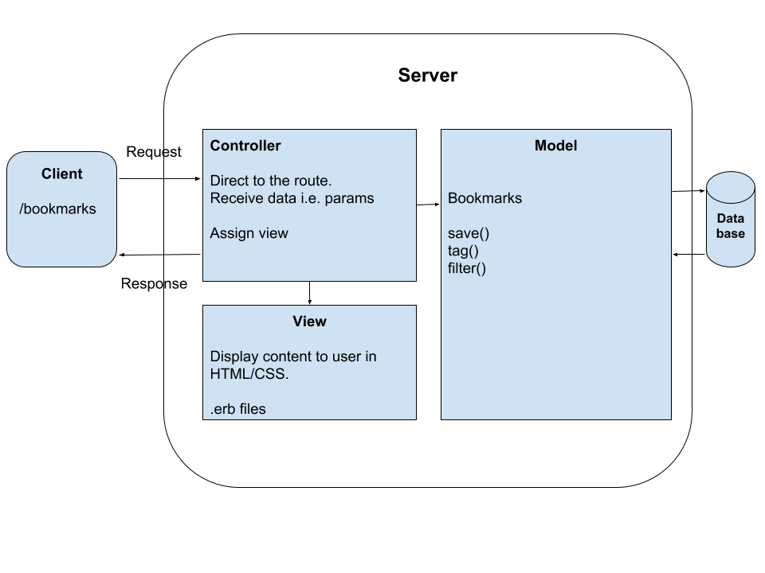

## Bookmark Manager

Week 4 pairing project. Instructions can be found [here](https://github.com/makersacademy/course/blob/master/bookmark_manager/00_challenge_map.md)

### User Stories

>As a user, 
I would like to save and see my list of bookmarks.

>As a user,  
I would like to add and delete bookmarks  
so that I can update bookmarks  

>As a user,  
I would like to tag my bookmarks into categories,  
so that I can filter bookmarks by tag and mange them.

### Domain Model

